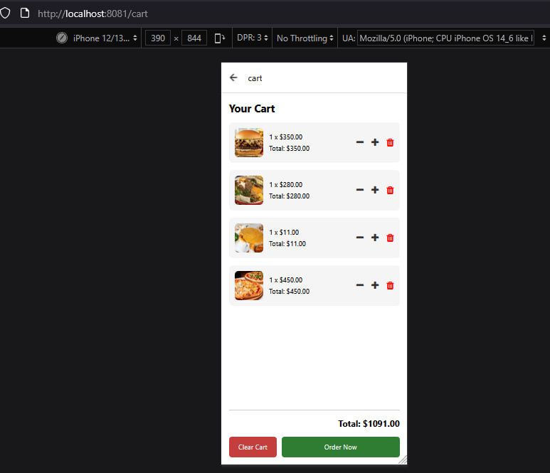
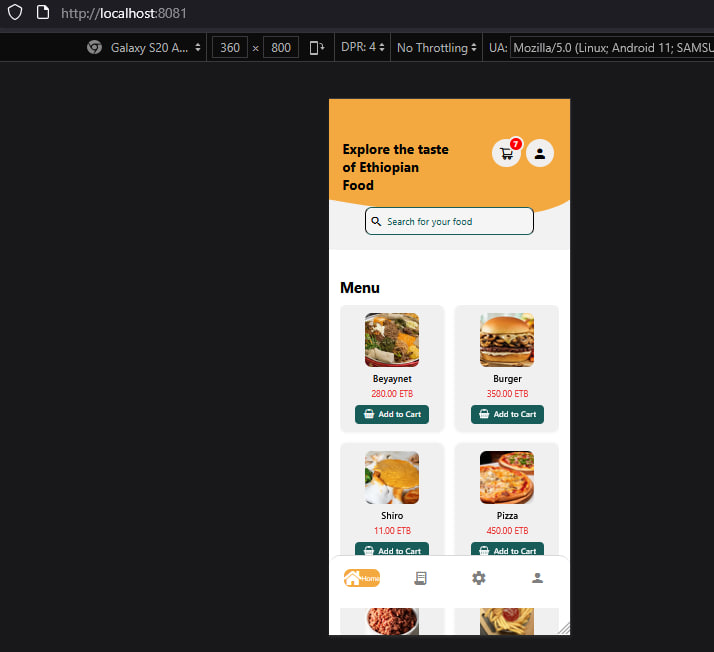
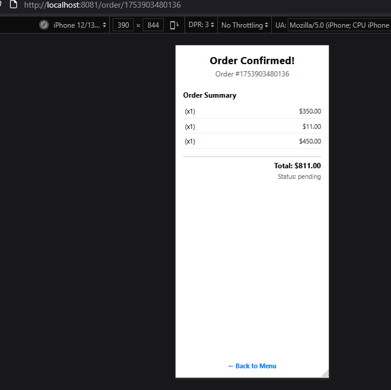

🍽️ Food Ordering App

This is a simple full-stack food ordering application built with React Native (Expo) for the frontend and Node.js (Express) for the backend. It allows users to browse menu items, add them to a cart, and place orders.

Backend Setup
    cd Backend
    npm i
    npm run start

📱 Frontend Setup
    cd Frontend
    cd food-ordering
    npm install
    npx expo start
🖼️ Screenshots
    
    
    